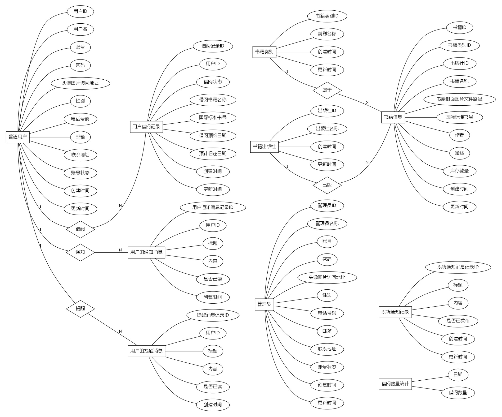
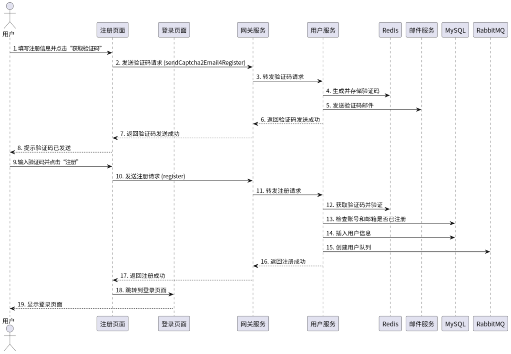
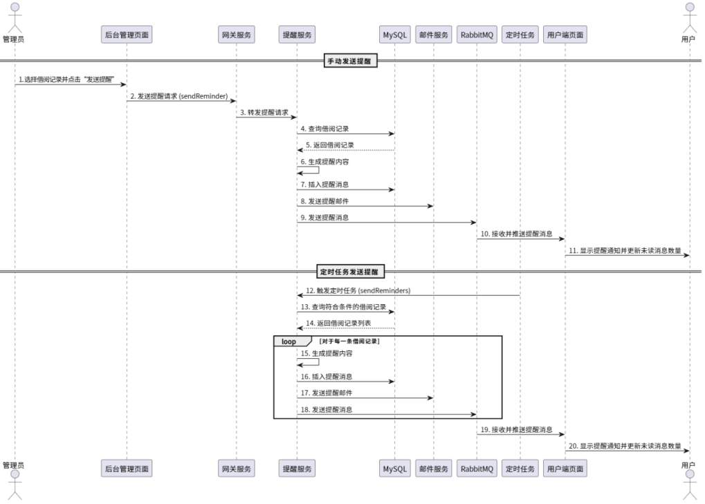

# 书籍借阅系统项目技术文档

## 1. 项目概述

### 1.1 项目背景

$~~~~~~$传统的书籍借阅管理系统通常采用单体架构，所有功能模块高度耦合，导致系统难以扩展和维护。随着业务需求的不断增加，单体架构的系统往往面临性能瓶颈和开发效率低下的问题。针对这些问题微服务架构应运而生。微服务架构根据业务功能将系统拆分为多个独立的微服务，通过这种方式提升系统的灵活性、扩展性和可维护性。同时，使用Docker对项目进行容器化部署，系统可以实现快速迭代交付，以适应不断变化的业务需求。

### 1.2 项目目的与目标

- 目的：为读者提供一个可以提供书籍网借服务的系统。
- 目标：
  - 提供可靠的用户认证和授权机制。
  - 确保系统的可扩展性和可维护性。

### 1.3 项目范围

- 包含功能：
  - 用户管理（注册、登录、启用/禁用账号、用户信息维护、邮箱绑定、更改密码）
  - 书籍借阅管理（借阅预约、取消预约、借阅登记、归还登记、借阅状态跟踪）
  - 数据查询与展示
  - 消息管理（发送邮件、消息定向实时推送、消息广播实时推送、消息标记已读/未读）
- 不包含功能：
  - 不包括支付功能
  - 不支持社交媒体集成

### 1.4 技术栈

- 编程语言：Java 17
- 框架：Spring Boot 3.0.2, Spring Cloud Alibaba 2022.0.0.0-RC2, MyBatis Plus 3.5.5, Knife4j 4.4.0
- 数据库：MySQL 8.0
- 前端：Vue.js 3
- 构建工具：Maven 3.8.8
- 版本控制：Git, GitHub

## 2. 系统架构设计

### 2.1 架构概述

- 架构类型：分布式架构，前后端分离
- 部署方式：本地部署，Docker容器化
- 通信协议：HTTP，使用RESTful API
- 开发模式：敏捷开发，持续集成（CI）

### 2.2 系统模块

#### 2.2.1 安全模块

- 功能：
  - 身份验证：使用JWT

#### 2.2.2 API模块

- 功能：
  - RESTful API设计
  - 系统中集成了Knife4j可以直观地查看各个微服务的API接口
  - 支持跨域请求

#### 2.2.3 用户管理模块

- 功能：
  - 用户注册与登录
  - 启用/禁用账号
  - 邮箱绑定
  - 更改密码

#### 2.2.4 消息管理模块

- 功能：
  - 消息实时推送（定向/广播）
  - 发送邮件
  - 标记消息状态（已读/未读）

#### 2.2.4 书籍借阅管理模块

- 功能：
  - 借阅操作全流程（借阅预约、取消预约、借阅登记、归还登记、借阅状态跟踪）
  - 以折线图的形式展示历史借阅量

#### 2.2.4 书籍信息管理模块

- 功能：
  - 书籍信息维护（增删改查）

## 3. 需求分析

### 3.1 用户需求

- 普通用户
  
  $~~~~~~$对于普通用户而言，其核心需求集中在便捷的借阅流程以及良好的用户体验方面，普通用户通过简单的注册流程来创建账号，并依靠安全的登录机制访问系统，用户可以通过多种条件迅速检索到所需书籍，还可查看书籍的详细信息。用户可在网上预约借阅书籍，查看借阅记录，跟踪借阅状态，并且支持取消预约或者删除已完成的借阅记录。用户可接收系统推送的实时消息通知，比如借阅到期提醒、逾期通知、预约提醒等，并支持标记消息状态或删除冗余消息，用户能够维护个人资料，包括编辑基本信息、更换头像、换绑邮箱、修改密码等操作。用户期望系统界面简洁且直观，操作流畅，响应快速，能够提供优良的交互体验。
- 管理员
  
  $~~~~~~$管理员的核心需求是高效便捷的书籍借阅管理和系统维护，管理员能够对书籍信息进行数据维护操作，对书籍信息进行增删改查，支持按分类、出版社等条件来筛选书籍，管理员能够查看用户的借阅记录，处理用户提出的借阅、归还请求，跟踪借阅状态。管理员可以手动创建、编辑、发布系统通知，可以依据用户的借阅状态自动触发提醒通知，比如借阅到期提醒、逾期通知等。管理员可借助可视化图表监控系统的借阅量，分析历史数据。管理员拥有更高的系统权限，能够禁用和解禁普通用户的账号，也能够创建新的管理员账号。

### 3.1 功能需求

- 用户注册功能
  - 用户能够通过注册页面填写注册信息创建新账户。
  - 系统能够验证用户名、密码、邮箱等注册填写信息的合法性。
  - 系统能够发送邮箱验证码进行验证。
- 用户登录功能
  - 用户能够通过登录页面填写账号、密码、验证码等信息进行登录。
- 数据管理功能
  - 支持数据的增、删、改、查操作。
  - 支持对数据进行筛选、排序和分页。
- 消息管理功能
  - 管理员能够手动向用户发送提醒消息、向所有用户发布系统通知。
  - 系统依据用户的借阅状态自动推送消息，比如预约临期提醒、预约到期提醒、借阅临期提醒、借阅到期提醒等消息。
  - 用户可接收系统推送的实时消息通知，并支持标记消息状态。
- 借阅管理功能
  - 管理员能够查看用户的借阅记录，处理用户提出的借阅、归还请求。
  - 管理员能够通过直观查看历史借阅量折线图。
- 安全与认证
  - 系统支持邮箱验证、图形验证码。

### 3.2 界面设计

#### 3.2.1 登录与注册页面

- **目标**：用户通过简单直观的界面完成注册和登录流程。
- 设计要求：
  - 界面应简洁，突出注册和登录按钮。
  - 登录页面应提供“忘记密码”和“注册新账号”的链接。
  - 注册页面需要用户填写必要信息（如用户名、邮箱、密码、邮箱验证码等）。

#### 3.2.2 借阅书籍展示页面

- **目标**：用户能够快速检索到目标书籍，完成借阅预约。
- 设计要求：
  - 以表格形式展示书籍信息（如书名、封面、ISBN、作者、出版社、库存等）。
  - 提供搜索框和筛选条件（如按类别、出版社过滤）。
  - 支持分页显示，支持按页号直接跳转，支持按库存数量进行排序。

#### 3.2.3 个人资料页面

- **目标**：用户能够对个人信息进行维护。
- 设计要求：
  - 用户能够更改性别、手机号、邮箱、联系地址、密码等信息。

#### 3.2.4 借阅记录页面

- **目标**：用户能够查看借阅记录，跟踪借阅状态。
- 设计要求：
  - 以表格形式展示借阅记录信息（如借阅状态、书名、ISBN、借阅预约日期、归还日期等）。
  - 对于借阅状态为“已预约”的记录提供取消预约操作。
  - 对于借阅状态为“已取消”、“已归还”或“预约已失效”的记录提供删除操作。
  - 提供搜索框和筛选条件（如按借阅状态过滤）
  - 支持按日期排序。

#### 3.2.4 消息中心页面

- **目标**：用户能够在该页面查看系统推送的消息。
- 设计要求：
  - 以列表形式展示消息记录。
  - 支持按消息查看状态（已读/未读）进行筛选。
  - 提供消息状态标记、批量标记、删除、批量删除等操作。
  - 在页面的导航栏中消息图标右上角会准确显示未读消息数量。

#### 3.2.4 借阅登记页面

- **目标**：管理员能够查看用户的借阅记录，处理用户提出的借阅、归还请求，发送提醒消息。
- 设计要求：
  - 在用户借阅记录界面中以表格形式展示用户借阅记录，对于每一条借阅记录提供借阅登记、归还登记、提醒操作。
  - 提供搜索框和筛选条件（如按借阅状态过滤）。
  - 支持按日期排序。

#### 3.2.5 系统通知页面

- **目标**：管理员能够创建和编辑系统通知内容，发布系统通知。
- 设计要求：
  - 以表格形式展示系统通知记录，对于每一条通知记录提供编辑、删除、发布操作。
  - 提供搜索框。
  - 支持按日期排序。

#### 3.2.6 报表页面

- **目标**：管理员能够查看系统历史借阅量。
- 设计要求：
  - 支持图表展示，用户能够选择不同的报表类型（如柱状图、折线图等）。
  - 报表支持框选区域进行查看。

## 4. 数据库设计

### 4.1 数据库概述

- 数据库类型：MySQL 8.0
- 数据库引擎：InnoDB
- 数据库设计模式：关系型数据库设计
- 表与关系设计：ER图



### 4.2 数据库表设计

#### 4.2.1 管理员信息表（`admin`）

|字段名|数据类型|可否为空|是否主键|默认值|说明|
|--|--|--|--|--|--|
|id|char(19)|否|是|NULL|管理员ID|
|name|varchar(255)|否|否|NULL|管理员名称|
|account|varchar(255)|否|否|NULL|账号|
|password|varchar(255)|否|否|NULL|密码|
|img_url|varchar(255)|是|否|NULL|头像图片访问地址|
|gender|tinyint(1)|是|否|NULL|性别|
|phone|char(11)|是|否|NULL|电话号码|
|email|varchar(255)|是|否|NULL|邮箱|
|address|varchar(255)|是|否|NULL|联系地址|
|status|tinyint(1)|否|否|1|账号状态|
|create_time|timestamp|否|否|CURRENT_TIMESTAMP|创建时间|
|update_time|timestamp|否|否|CURRENT_TIMESTAMP|更新时间|

---

#### 4.2.2 用户信息表（`user`）

|字段名|数据类型|可否为空|是否主键|默认值|说明|
|--|--|--|--|--|--|
|id|char(19)|否|是|NULL|用户ID|
|name|varchar(255)|否|否|NULL|用户名|
|account|varchar(255)|否|否|NULL|账号|
|password|varchar(255)|否|否|NULL|密码|
|img_url|varchar(255)|是|否|NULL|头像图片访问地址|
|gender|tinyint(1)|是|否|NULL|性别：0-男，1-女|
|phone|char(11)|是|否|NULL|电话号码|
|email|varchar(255)|是|否|NULL|邮箱|
|address|varchar(255)|是|否|NULL|联系地址|
|status|tinyint(1)|否|否|1|账号状态|
|create_time|timestamp|否|否|CURRENT_TIMESTAMP|创建时间|
|update_time|timestamp|否|否|CURRENT_TIMESTAMP|更新时间|

#### 4.2.3 书籍信息表（`book`）

|字段名|数据类型|可否为空|是否主键|默认值|说明|
|--|--|--|--|--|--|
|id|char(19)|否|是|NULL|书籍ID|
|category_id|char(19)|否|否|NULL|书籍类别ID|
|publisher_id|char(19)|否|否|NULL|出版社ID|
|name|varchar(255)|否|否|NULL|书籍名称|
|img_url|varchar(255)|否|否|NULL|书籍封面访问地址|
|isbn|char(13)|否|否|NULL|国际标准书号|
|author|varchar(255)|否|否|NULL|作者|
|description|text|是|否|NULL|描述|
|stock|int unsigned|否|否|0|库存数量|
|create_time|timestamp|否|否|CURRENT_TIMESTAMP|创建时间|
|update_time|timestamp|否|否|CURRENT_TIMESTAMP|更新时间|

---

#### 4.2.4 用户借阅记录表（`borrow`）

|字段名|数据类型|可否为空|是否主键|默认值|说明|
|--|--|--|--|--|--|
|id|char(19)|否|是|NULL|借阅记录ID|
|user_id|char(19)|否|否|NULL|用户ID|
|status|enum|否|否|'reserved'|借阅状态|
|book_name|varchar(255)|否|否|NULL|借阅书籍名称|
|isbn|char(13)|否|否|NULL|国际标准书号|
|reserve_date|date|否|否|NULL|借阅预约日期|
|return_date|date|否|否|NULL|预计归还日期|
|create_time|timestamp|否|否|CURRENT_TIMESTAMP|创建时间|
|update_time|timestamp|否|否|CURRENT_TIMESTAMP|更新时间|

---

#### 4.2.5 借阅数量统计表（`borrow_statistics`）

|字段名|数据类型|可否为空|是否主键|默认值|说明|
|--|--|--|--|--|--|
|date|date|否|是|NULL|日期|
|quantity|int unsigned|否|否|0|借阅数量|

---

#### 4.2.6 书籍类别表（`category`）

|字段名|数据类型|可否为空|是否主键|默认值|说明|
|--|--|--|--|--|--|
|id|char(19)|否|是|NULL|书籍类别ID|
|name|varchar(255)|否|否|NULL|类别名称|
|create_time|timestamp|否|否|CURRENT_TIMESTAMP|创建时间|
|update_time|timestamp|否|否|CURRENT_TIMESTAMP|更新时间|

---

#### 4.2.7 用户通知消息表（`notice`）

|字段名|数据类型|可否为空|是否主键|默认值|说明|
|--|--|--|--|--|--|
|id|char(19)|否|是|NULL|通知消息记录ID|
|user_id|char(19)|否|否|NULL|用户ID|
|title|varchar(255)|否|否|NULL|标题|
|content|text|否|否|NULL|内容|
|status|tinyint(1)|否|否|0|是否已读（0未读）|
|create_time|timestamp|否|否|CURRENT_TIMESTAMP|创建时间|

---

#### 4.2.8 出版社信息表（`publisher`）

|字段名|数据类型|可否为空|是否主键|默认值|说明|
|--|--|--|--|--|--|
|id|char(19)|否|是|NULL|出版社ID|
|name|varchar(255)|否|否|NULL|出版社名称|
|create_time|timestamp|否|否|CURRENT_TIMESTAMP|创建时间|
|update_time|timestamp|否|否|CURRENT_TIMESTAMP|更新时间|

---

#### 4.2.9 用户提醒消息表（`reminder`）

|字段名|数据类型|可否为空|是否主键|默认值|说明|
|--|--|--|--|--|--|
|id|char(19)|否|是|NULL|提醒消息记录ID|
|user_id|char(19)|否|否|NULL|用户ID|
|title|varchar(255)|否|否|NULL|标题|
|content|text|否|否|NULL|内容|
|status|tinyint(1)|否|否|0|是否已读（0未读）|
|create_time|timestamp|否|否|CURRENT_TIMESTAMP|创建时间|

---

#### 4.2.10 系统通知消息表（`system_notice`）

|字段名|数据类型|可否为空|是否主键|默认值|说明|
|--|--|--|--|--|--|
|id|char(19)|否|是|NULL|系统通知消息记录ID|
|title|varchar(255)|否|否|NULL|标题|
|content|text|否|否|NULL|内容|
|status|tinyint(1)|否|否|0|是否已发布（0未发布）|
|create_time|timestamp|否|否|CURRENT_TIMESTAMP|创建时间|
|update_time|timestamp|否|否|CURRENT_TIMESTAMP|更新时间|

## 5. 代码实现

### 5.1 代码结构

#### 5.1.1 前端代码结构

```
├─ public/              #存放静态资源（如图标、全局CSS/JS）
├─ src/                 #核心开发目录
│  ├─ api/              #按模块划分的API文件
│  ├─ assets/           #静态资源（图片、SCSS文件、字体等）
│  ├─ components/       #可复用组件
│  ├─ router/           #路由配置（定义路由路径、懒加载、导航守卫）
│  ├─ stores/           #Pinia状态管理
│  ├─ utils/            #工具函数/辅助类（如axios请求封装）
│  ├─ views/            #页面级组件（路由直接引用的组件）
│  ├─ App.vue           #根组件
│  └─ main.js           #应用主入口（初始化Vue实例并挂载根组件）
├─ index.html           #项目入口HTML文件
├─ package.json         #项目配置和依赖管理（包含scripts命令、dependencies等）
└─ vite.config.js       #Vite配置（代理、插件、路径别名等配置）

```

#### 5.1.1 后端代码结构

```
├─ Dockerfile                                         #定义容器化部署的镜像构建步骤（如JDK版本、依赖安装、启动命令等）
├─ pom.xml                                            #Maven项目配置文件（管理依赖库、插件、模块版本等）
└─ src/
   ├─ main/
   │  ├─ java/
   │  │  └─ org/
   │  │     └─ example/
   │  │        └─ projectname/
   │  │           ├─ config/                          #配置层
   │  │           ├─ controller/                      #控制层
   │  │           ├─ entity/                          #实体类
   │  │           ├─ handler/
   │  │           │  └─ GlobalExceptionHandler.java   #全局处理器（统一捕获异常，返回标准化错误信息）
   │  │           ├─ listener/                        #监听器
   │  │           ├─ mapper/                          #数据访问层（MyBatis-Plus的Mapper接口，定义数据库操作）
   │  │           ├─ pojo/
   │  │           │  ├─ dto/                          #数据传输对象（用于接收前端参数或返回复杂数据结构）
   │  │           │  ├─ query/                        #查询条件封装对象（如分页、筛选条件）
   │  │           │  └─ vo/                           #视图对象（定制化返回给前端的数据结构）
   │  │           ├─ service/                         #服务层
   │  │           ├─ task/                            #定时任务
   │  │           └─ Application.java                 #SpringBoot主启动类
   │  └─ resources/                                   #资源配置层
   │     ├─ application-dev.yaml                      #开发环境配置
   │     ├─ application-prod.yaml                     #生产环境配置
   │     ├─ bootstrap.yaml                            #系统级配置
   │     └─ mapper/                                   #MyBatis的XML映射文件（存放复杂SQL）
   └─ test/                                           #测试层
```

### 5.2 核心功能

#### 5.2.1 用户注册功能

##### 核心代码实现

```java
@Slf4j
@RequiredArgsConstructor
@Service
public class UserServiceImpl extends ServiceImpl<UserMapper, User> implements IUserService {

    private final UserMapper userMapper;
    private final RedisTemplate<String, String> redisTemplate;
    private final RabbitTemplate rabbitTemplate;
    private final CodeGenerator randomCodeGenerator = new RandomGenerator(RandomUtil.BASE_NUMBER, 6);
    
    @Override
    public void register(UserRegisterDTO userRegisterDTO) {
        // 根据邮箱地址获取redis缓存中的验证码
        String email = userRegisterDTO.getEmail();
        String code = redisTemplate.opsForValue().get("codeCache:" + email);
        if (Objects.isNull(code)) {
            log.info("获取redis缓存中的验证码失败 email: {}, msg: {}", email, MessageConstant.CODE_NOT_FOUND);
            throw new NotFoundException(MessageConstant.CODE_NOT_FOUND);
        }
        // 验证码校验
        String userInputCode = userRegisterDTO.getCode();
        if (!randomCodeGenerator.verify(code, userInputCode)) {
            log.info("验证码校验不通过 code: {}, userInputCode: {}, msg: {}", code, userInputCode, MessageConstant.CODE_ERROR);
            throw new CheckException(MessageConstant.CODE_ERROR);
        }
        // 查询账号是否已存在
        String account = userRegisterDTO.getAccount();
        LambdaQueryWrapper<User> queryWrapper1 = new LambdaQueryWrapper<User>()
                .eq(User::getAccount, account);
        if (userMapper.exists(queryWrapper1)) {
            throw new AlreadyExistsException(MessageConstant.ACCOUNT_ALREADY_EXISTS);
        }

        String phone = userRegisterDTO.getPhone();
        if (Objects.nonNull(phone)) {
            // 查询电话号码是否已存在
            LambdaQueryWrapper<User> queryWrapper2 = new LambdaQueryWrapper<User>()
                    .eq(User::getPhone, phone);
            if (userMapper.exists(queryWrapper2)) {
                throw new AlreadyExistsException(MessageConstant.PHONE_ALREADY_EXISTS);
            }
        }

        // 构建用户对象
        User user = new User();
        BeanUtil.copyProperties(userRegisterDTO, user);
        // 新增用户信息
        userMapper.insert(user);

        // 查询新增的用户信息的ID
        LambdaQueryWrapper<User> queryWrapper = new LambdaQueryWrapper<User>()
                .select(User::getId)
                .eq(User::getAccount, user.getAccount());
        String userId = userMapper.selectOne(queryWrapper).getId();

        //构建RabbitAdmin对象，用于管理（声明或删除）RabbitMQ的队列、交换机和绑定关系
        RabbitAdmin rabbitAdmin = new RabbitAdmin(rabbitTemplate);
        //构建队列对象
        Queue noticeQueue = new Queue(RabbitMQConstant.NOTICE_QUEUE + userId);
        Queue reminderQueue = new Queue(RabbitMQConstant.REMINDER_QUEUE + userId);
        //构建交换机对象
        FanoutExchange noticeFanoutExchange = new FanoutExchange(RabbitMQConstant.NOTICE_FANOUT_EXCHANGE);
        DirectExchange reminderDirectExchange = new DirectExchange(RabbitMQConstant.REMINDER_DIRECT_EXCHANGE);
        //构建绑定关系对象
        Binding noticeBinding = BindingBuilder.bind(noticeQueue).to(noticeFanoutExchange);
        Binding reminderBinding = BindingBuilder.bind(reminderQueue).to(reminderDirectExchange).with(userId);
        //声明队列，即如果队列不存在则创建它
        rabbitAdmin.declareQueue(noticeQueue);
        rabbitAdmin.declareQueue(reminderQueue);
        //声明交换机，即如果交换机不存在则创建它
        rabbitAdmin.declareExchange(noticeFanoutExchange);
        rabbitAdmin.declareExchange(reminderDirectExchange);
        //声明绑定关系，将队列绑定到交换机
        rabbitAdmin.declareBinding(noticeBinding);
        rabbitAdmin.declareBinding(reminderBinding);
    }
}
```

##### 时序图



#### 5.2.2 消息实时推送

##### 核心代码实现

```java
// 发送消息，触发前端的消息提醒
rabbitTemplate.convertAndSend(RabbitMQConstant.REMINDER_DIRECT_EXCHANGE, userId, "");
```

```javascript
// 前端使用Stomp连接RabbitMQ，
const stompClient = new Client({
  brokerURL: "ws://localhost:15674/ws", //RabbitMQ的连接ip地址
  // 这里设置RabbitMQ登录的用户名和密码
  connectHeaders: {
    login: "guest",
    passcode: "guest",
    host: "/", //虚拟主机，默认"/"
  },
  // 回调，在连接之前调用。
  beforeConnect: () => {
    console.log("开始连接RabbitMQ");
  },
  // 回调，每次成功连接时调用。IFrame作为参数传递给该回调。
  onConnect: () => {
    console.log("成功连接RabbitMQ");
    // 订阅系统通知消息
    stompClient.subscribe(
      // destination: "/topic/EXCHANGE_NAME/ROUTING_KEY"或者"/exchange/EXCHANGE_NAME/ROUTING_KEY"或者"/queue/QUEUE_NAME"
      `/queue/bookstore.notice.${userStore.user.id}`,
      // 当客户端从服务器接收到 STOMP 消息时调用
      (message) => {
        createNotice(JSON.parse(message.body)).then((res) => {
          if (res.data.code) {
            badgeStore.unreadNoticeCount++;
            ElNotification(); // 触发提醒弹窗
          }
        });
      },
      // 如果在headers参数中没有提供id，STOMP将生成一个唯一的id。
      {}
    );
    // 订阅提醒消息
    stompClient.subscribe(
      `/queue/bookstore.reminder.${userStore.user.id}`,
      (message) => {
        badgeStore.unreadReminderCount++;
        ElNotification(); // 触发提醒弹窗
      }
    );
  },
  // 回调，每次成功断开连接时调用。如果由于错误而断开连接，则不会被调用。
  onDisconnect: () => {
    console.log("断开连接RabbitMQ");
  },
  // 回调，在遇到错误时调用。IFrame将作为参数传递给回调。在遇到任何错误之后会终止连接。
  onStompError: (frame) => {
    // 使用了不正确的 login/passcode 通常会导致错误
    console.log("错误信息：" + frame.headers["message"]);
    console.log("详细信息：" + frame.body);
  },
  // 回调，如果接收到未知类型的IFrame，则将被调用。IFrame作为参数传递给该回调。
  onUnhandledFrame: (frame) => {
    console.log("接收到未知类型的IFrame：", frame);
  },
  debug: () => {}, //默认情况下，调试信息会被丢弃。可以通过传递给该回调的参数进行查看。比如(str) => {console.log(str)}
  onWebSocketClose: () => {}, //回调，当底层WebSocket关闭时调用。CloseEvent作为参数传递给该回调。
  onWebSocketError: () => {}, //回调，当底层WebSocket引发错误时调用。Event作为参数传递给该回调。
  connectionTimeout: 0, //如果在指定的毫秒内没有建立Stomp连接，将进行重试。默认值为 0，这会关闭自动重新连接。
  heartbeatIncoming: 10000,
  heartbeatOutgoing: 10000, //以毫秒为单位的传出心跳间隔。设置为 0 则禁用。
  reconnectDelay: 5000, //以毫秒为单位自动延迟重新连接，设置为 0 则禁用。
  stompVersions: new Versions(["1.2", "1.1", "1.0"]), //在STOMP握手期间尝试的STOMP版本。默认情况下，尝试版本 1.2、1.1 和 1.0。
});
// 启动连接。如果连接中断，按照stompClient.reconnectDelay，它将持续尝试重新连接。
stompClient.activate();
```

##### 时序图



### 5.3 异常处理

```java
/**
 * 全局异常处理器
 * "@ControllerAdvice"默认只会处理Controller层抛出的异常
 */
@Slf4j
@RestControllerAdvice //定义一个全局的异常处理类
public class GlobalExceptionHandler {

    /**
     * 处理业务异常
     *
     * @param e 业务异常
     * @return 响应提示信息
     */
    @ExceptionHandler //捕获和处理特定的异常类型
    public Result<Object> exceptionHandler(ServiceException e) {
        log.error("业务异常 ServiceException: {}", e.getMessage());
        return Result.error(e.getMessage());
    }

    /**
     * 处理被@Valid注解的参数没有通过验证时产生的异常
     *
     * @param e 方法参数无效异常
     * @return 响应提示信息
     */
    @ExceptionHandler
    public Result<Object> exceptionHandler(MethodArgumentNotValidException e) {
        List<FieldError> fieldErrors = e.getFieldErrors();
        String logInfo = fieldErrors.stream()
                .map(fieldError -> "\n对象: " + fieldError.getObjectName()
                        + ", 字段: " + fieldError.getField()
                        + ", 拒绝值: " + fieldError.getRejectedValue()
                        + ", 提示信息: " + fieldError.getDefaultMessage()
                )
                .collect(Collectors.joining("; "));
        log.info("参数校验不通过 {}", logInfo);
        String message = fieldErrors.stream()
                .map((fieldError)-> fieldError.getField() + fieldError.getDefaultMessage())
                .collect(Collectors.joining("；"));
        return Result.error(message);
    }
}
```

## 6. 部署与运行

（1）安装Docker

（2）创建并启动项目所需组件容器

```sh
docker run -d ^
  --name mysql ^
  --privileged=true ^
  -p 3306:3306 ^
  -e TZ=Asia/Shanghai ^
  -e MYSQL_ROOT_PASSWORD=root ^
  -v C:\Users\Administrator\Documents\volumes\mysql\data:/var/lib/mysql ^
  -v C:\Users\Administrator\Documents\volumes\mysql\conf:/etc/mysql/conf.d ^
  mysql:8.4.3-oraclelinux9
```

```sh
docker run -d ^
  --name redis ^
  --privileged=true ^
  -p 6379:6379 ^
  -e TZ=Asia/Shanghai ^
  -v C:\Users\Administrator\Documents\volumes\redis\conf:/usr/local/etc/redis ^
  -v C:\Users\Administrator\Documents\volumes\redis\data:/data ^
  redis:7.4.1-alpine3.20 redis-server /usr/local/etc/redis/redis.conf
```

```sh
docker run -d ^
  --hostname my-rabbit ^
  --name rabbitmq ^
  --privileged=true ^
  -p 5672:5672 ^
  -p 15672:15672 ^
  -p 15674:15674 ^
  -e TZ=Asia/Shanghai ^
  -v C:\Users\Administrator\Documents\volumes\rabbitmq:/var/lib/rabbitmq ^
  rabbitmq:3.13.7-management-alpine

docker exec -it rabbitmq rabbitmq-plugins enable rabbitmq_management
docker exec -it rabbitmq rabbitmq-plugins enable rabbitmq_web_stomp
```

```sh
docker run -d ^
  --name nacos ^
  --privileged=true ^
  -p 8848:8848 ^
  -p 9848:9848 ^
  -e TZ=Asia/Shanghai ^
  -e MODE=standalone ^
  -v C:\Users\Administrator\Documents\volumes\nacos\conf\application.properties:/home/nacos/conf/application.properties ^
  nacos/nacos-server:v2.4.3-slim
```

```sh
docker run -d ^
  --name nginx ^
  --privileged=true ^
  -p 81:81 ^
  -p 82:82 ^
  -e TZ=Asia/Shanghai ^
  -v C:\Users\Administrator\Documents\volumes\nginx\conf\conf.d:/etc/nginx/conf.d ^
  -v C:\Users\Administrator\Documents\volumes\nginx\conf\nginx.conf:/etc/nginx/nginx.conf ^
  -v C:\Users\Administrator\Documents\volumes\nginx\html:/usr/share/nginx/html ^
  nginx:1.26.2-alpine3.20-slim
```

```sh
docker run -d ^
  --name sentinel-dashboard ^
  --privileged=true ^
  -p 8719:8719 ^
  -p 8858:8858 ^
  -e TZ=Asia/Shanghai ^
  bladex/sentinel-dashboard:1.8.7
```

（3）数据库配置

在MySQL中创建数据库。导入项目SQL文件以及Nacos的SQL文件。

（4）后端项目配置

配置application.yml和bootstrap.yml文件，配置MySQL、Nacos、Sentinel、Redis、RabbitMQ等组件的连接IP地址。

在Nacos配置中心创建并完成项目以及相关组件的配置。

（5）使用Maven构建后端项目，打包生成JAR文件

```sh
mvn clean install
```

（6）为各个微服务编写Dockerfile

```dockerfile
# 基础镜像
FROM openjdk:17-jdk-alpine
# 设定时区
ENV TZ=Asia/Shanghai
RUN ln -snf /usr/share/zoneinfo/$TZ /etc/localtime && echo $TZ > /etc/timezone
# 安装依赖库和字体
RUN apk add --no-cache freetype fontconfig ttf-dejavu
# 设置字体目录
ENV JAVA_FONTS=/usr/share/fonts/truetype/dejavu
# 复制应用程序
COPY ./target/admin-service-0.0.1-SNAPSHOT.jar /app/my-app.jar
# 设置工作目录
WORKDIR /app
# 容器启动时要执行的命令（启动应用程序）
ENTRYPOINT ["java","-Dserver.port=8082","-Dspring.profiles.active=prod","-jar","my-app.jar"]
```

（7）编写docker-compose.yaml

```yaml
services:
  gateway-service:
    build:
      context: <该微服务的Dockerfile所在目录路径>
      dockerfile: Dockerfile
    container_name: gateway-service
    ports:
      - 8080:8080
    networks:
      - book-network
  common-service:
    build:
      context: <该微服务的Dockerfile所在目录路径>
      dockerfile: Dockerfile
    container_name: common-service
    ports:
      - 8081:8081
    networks:
      - book-network
    depends_on:
      - nacos
      - sentinel-dashboard
  admin-service:
    build:
      context: <该微服务的Dockerfile所在目录路径>
      dockerfile: Dockerfile
    container_name: admin-service
    ports:
      - 8082:8082
    networks:
      - book-network
  client-service:
    build:
      context: <该微服务的Dockerfile所在目录路径>
      dockerfile: Dockerfile
    container_name: client-service
    ports:
      - 8083:8083
    networks:
      - book-network
networks:
  book-network:
    name: book-network
```

（8）通过Docker Compose管理容器

```sh
# 创建相关镜像、容器、网络、卷并启动容器
docker compose -f ./docker-compose.yaml -p bookstore up -d
# 停止并移除相关容器、网络、卷和通过 docker compose 构建的本地镜像
docker compose -f ./docker-compose.yaml -p bookstore down --rmi local
```

（9）Nginx配置

/etc/nginx/nginx.conf：

```apache_conf
# 指定 Nginx 进程运行的用户为 nginx（安全考虑，避免 root 权限运行）
user nginx;
# 设置工作进程数为 1。设置为 auto 会自动匹配 CPU 核心数
worker_processes 1;
# 设置错误日志路径为 /var/log/nginx/error.log，日志级别为 notice
error_log /var/log/nginx/error.log notice;
# 设置 Nginx 主进程的 PID 存储文件路径
pid /var/run/nginx.pid;


events {
    # 设置每个工作进程的最大并发连接数为 1024
    worker_connections 1024;
}


http {
    include /etc/nginx/mime.types;
    default_type application/octet-stream;

    log_format main '$remote_addr - $remote_user [$time_local] "$request" '
    '$status $body_bytes_sent "$http_referer" '
    '"$http_user_agent" "$http_x_forwarded_for"';

    access_log /var/log/nginx/access.log main;

    sendfile on;
    #tcp_nopush     on;

    # 保持 TCP 连接的超时时间为 65 秒（减少重复握手开销）。
    keepalive_timeout 65;

    # 压缩响应数据以节省带宽
    #gzip  on;

    # 包含子配置。加载 /etc/nginx/conf.d/ 目录下所有 .conf 文件（模块化配置，如不同站点的配置可分开存放）。
    include /etc/nginx/conf.d/*.conf;
}
```

/etc/nginx/conf.d/client.conf：

```apache_conf
server {
    listen 82;
    server_name localhost;

    location ~ ^/api/ {
        # 重写URI，去除/api前缀
        rewrite ^/api(/.*)$ $1 break;

        # 反向代理
        proxy_pass http://172.25.72.90:8080; # 网关
    }
    location / {
        root /usr/share/nginx/html/client;
        # try_files指令可用于检查指定的文件或目录是否存在；如果不存在，则重定向到指定位置。
        try_files $uri $uri/ @router; # 如果不存在，则重定向到下面的@router否则会出现vue的路由在nginx中刷新出现404
        index index.html index.htm;
    }
    # 对应上面的@router，主要原因是路由的路径资源并不是一个真实的路径，所以无法找到具体的文件
    # 因此需要rewrite到index.html中，然后交给路由在处理请求资源
    location @router {
        root /usr/share/nginx/html/client;
        rewrite ^.*$ /index.html last;
    }

    #error_page  404              /404.html;

    # redirect server error pages to the static page /50x.html
    #
    error_page 500 502 503 504 /50x.html;
    location = /50x.html {
        root /usr/share/nginx/html/client;
    }
}
```

Nginx配置文件修改后执行`nginx -s reload`命令以重新加载配置。

（10）部署前端项目

使用Vite构建前端项目，打包生成静态文件，并将其置于Nginx容器中 /usr/share/nginx/html/ 对应的挂载目录下，以部署到Nginx服务器中。

## 7. 测试

### 7.1 测试策略

- 单元测试：使用JUnit测试单个类和方法。
- 接口测试：通过Knife4j的UI界面测试接口，查看响应结果是否符合预期。

### 7.3 测试用例示例

```java
@SpringBootTest
class BorrowServiceTest {

    @Autowired
    private IBorrowService borrowService;
    @Test
    void testBorrowRegister() {
        PageQuery pageQuery = new PageQuery();
        pageQuery.setCurrent(1L);
        pageQuery.setSize(10L);

        assertFalse(borrowService.pageQuery(pageQuery).getRecords().isEmpty());
    }
}
```

## 8. 性能优化与安全

### 8.1 性能优化

- 使用Redis+Spring Cache缓存高频展示数据，提高系统响应速度。

### 8.2 安全设计

- 使用JWT实现无状态身份认证。
